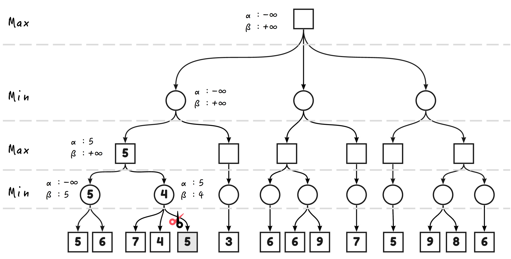
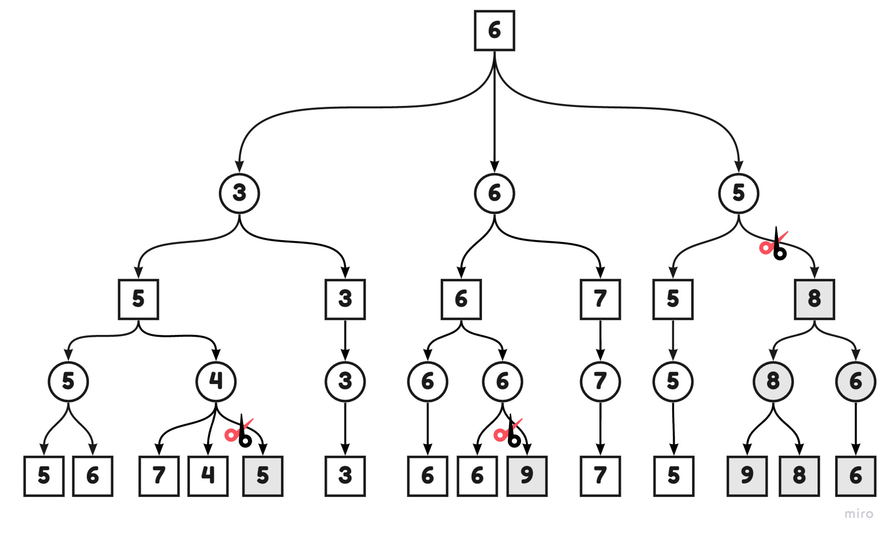

# Alpha Beta 剪枝

> 核心是固定深度

剪去 MAX 层叫 Alpha 剪枝

剪去 MIN 层叫 Beta 剪枝

## 触发剪枝的条件

* 当极小层某节点的 α 大于等于 β 时不需要继续遍历其子节点

  > 下图中 α=5，说明我们存在一个使我们得分至少为 5 的情况，如果在遍历子节点的过程中，发现 β 小于 α 了，不会继续遍历后面的节点，因为后面的分数如果更大，对手不可能会选，如果后面的分数更小，对手肯定会选，那我们更加不能选这条路，因此不需要继续考虑了

  

  对于[极大极小值搜索](MiniMax.md)一章的博弈树进行剪枝可得

  

* 当极大层某节点的 α 大于等于 β 时不需要继续遍历

  > 因为如果后面的分数更低，我们没必要选，如果后面的分数高，会导致这条路分数更高，对手不会选这条路，没必要继续考虑


## 代码实现

```python
# minimax.
def r(..., alpha, ...):
    # ...

    # 将 alpha 值与子节点分数做比较, 选出最大的分数给 alpha
    alpha = max(best["score"], alpha)

    # alpha-beta 剪枝
    if func.greatOrEqualThan(a, beta):
        ABcut += 1  # 剪枝数加一
        v["score"] = MAX - 1  # 被剪枝的用极大值来记录, 但是必须比 MAX 小
        v["abcut"] = 1  # 剪枝标记
        return v
```


## 参考资料

1. [极大极小值搜索和alpha-beta剪枝](https://www.codetd.com/article/7205806)
