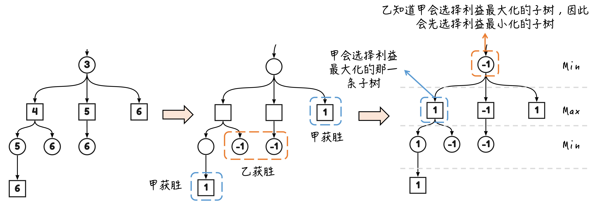
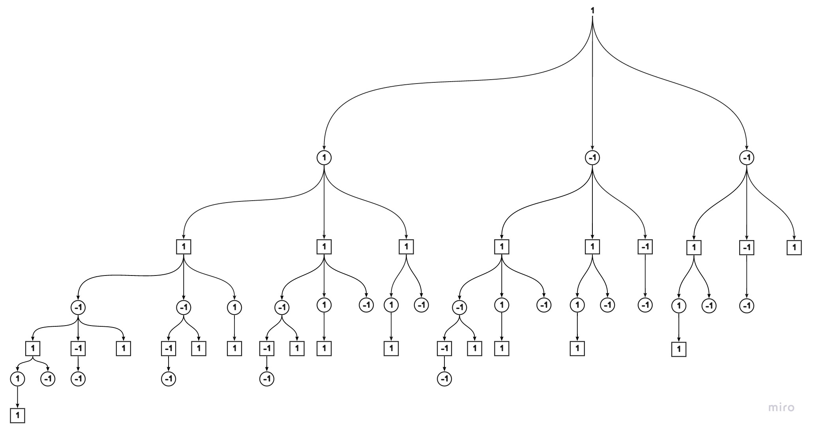
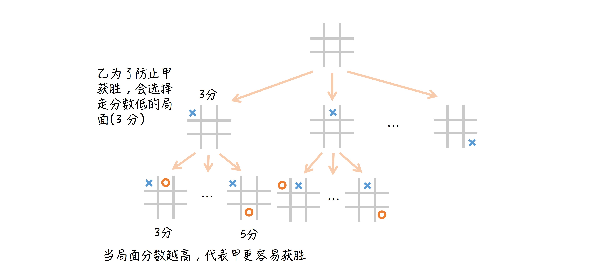
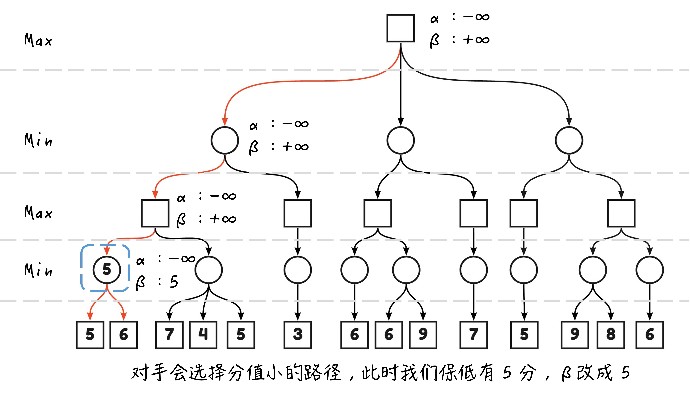
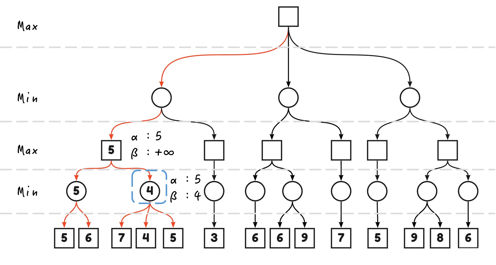
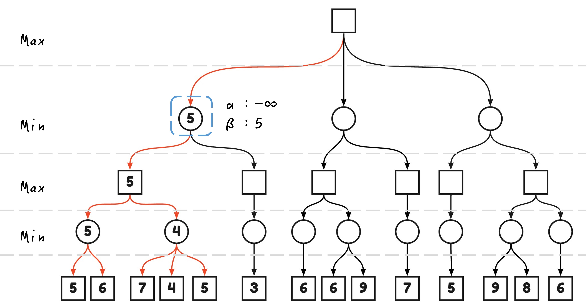
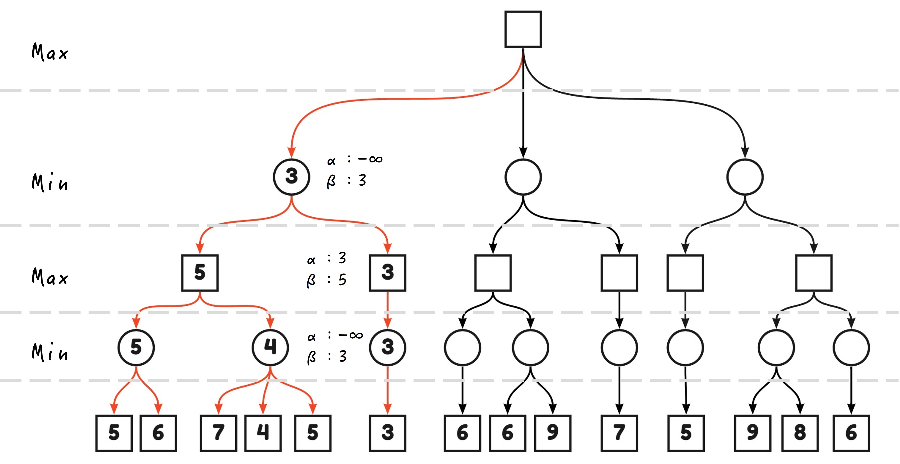
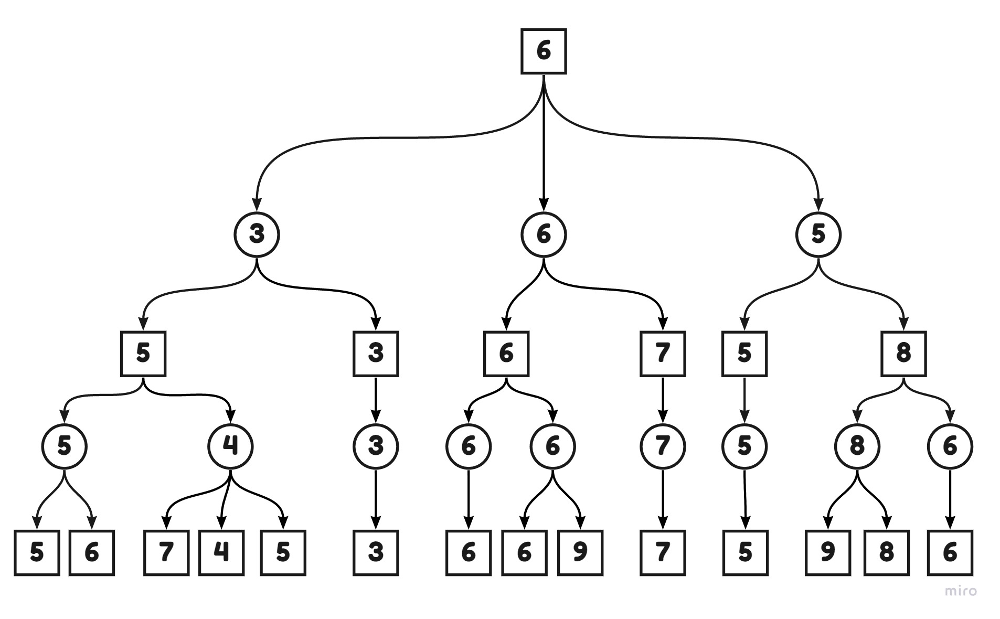

# 极大极小搜索

将[报数游戏](Game-Tree.md)中，将甲(自己)获胜用 1 代替，将乙(对手)获胜用 -1 代替

以根节点(树的最顶端)作为第一个极大层(Max)，极小层(Min)和极大层交替出现

极小层中选择子节点最小的数，极大层选择子节点最大的数

> 先手开始选择总是在偶数层(0、2、4...)，而第二个选手开始选择总是在奇数层(1、3、5...)，对应于先手位于极大层，第二个选手位于极小层，也就意味着，位于极大层的选手需要将自身利益最大化，会选择子节点中较大的那个，而位于极小层的选手会将对手的利益最小化，而选择子节点中最小的那个
>



> 根据上图可知，抽离博弈树的一部分后，这个子树的根节点是 -1，也就是说轮到乙选择了，局势变成这样的话，甲是不可能获胜的，因为乙肯定会选择对甲不利的 -1 这条路线

博弈树的最后结果



整个博弈树根节点的值所代表的就是先手在这场博弈中的结果(如果比赛双方都遵循最大最小值原则)

那些 -1 都是对甲不利的局面，也就代表了本场比赛的决胜权被对手掌握

# 井字游戏



## 打分函数

乙会尽力让评分降低，甲需要让评分更高，因此通过深度优先遍历，选择一条分值高的路径

> 打分函数根据日常经验来制定
>
> 令 α 为 -∞ 是为了让接下来任意一个比这个大的数可以替换掉 -∞

1. 根据给定深度进行遍历(图中仅仅遍历 5 层)

   首先将父节点的 α、β 值传递到叶子节点

   ```python
   negamax(board, candidates, role, i, MIN, MAX)
   ```

   

2. 进行回溯，节点处于 Max 层，因此 α 变成 5

   

   ```python
   if v["score"] > best["score"]:
       best = v
   # best在遍历子节点时选取分数最高f
   ```

3. 继续遍历兄弟树

   从子节点中 7、4、5 选一个最小的 4 作为 β 的值

   > 由于该兄弟节点的评分较小，回溯时不会改变 Max 层的 α 值

   

3. 继续回溯至第 1 层，由于是最小层，因此 β 改为 5(目前子节点最小只有 5)

   

5. 继续遍历第一层第一个节点的右子树

   

5. 以此类推，获得的最优选择是评分为 6 的路径

   > 这是全部遍历的情况，需要继续优化，参考[α-β剪枝](Alpha-Beta.md)
   
   

## 代码实现

```python
# minimax.py
def r(board, deep, alpha, beta, role, step, steps):
	# ...

    # 获取当前j棋盘分数
    _e = board.evaluate(role)

    leaf = {"score": _e, "step": step, "steps": steps}

    # 搜索到底(搜索范围：给定 depth ~ 0)或者已经胜利, 返回叶子节点
    if (deep <= 0 or func.greatOrEqualThan(_e, S["FIVE"])
            or func.littleOrEqualThan(_e, -S["FIVE"])):
        return leaf

    best = {"score": MIN, "step": step, "steps": steps}
    
    onlyThree = step > 1 if len(board.allSteps) > 10 else step > 3
    points = board.gen(role, onlyThree)  # 启发式评估, 获取整个棋盘下一步可能获胜的节点
    
    # 如果没有节点, 即当前节点是树叶, 直接返回
    if len(points) == 0:
        return leaf

    # 对可能获胜节点进行遍历
    for item in points:
        board.AIput(item["p"], role)  # 在可能获胜的节点上模拟落子
        _deep = deep - 1  # 深度减一

        _steps = steps.copy()  # 复制一下之前的步骤
        _steps.append(item)  # 步骤增加当前遍历的节点

        # 进行递归, 总步数加一
        v = r(board, _deep, -beta, -alpha, func.reverse(role), step + 1, _steps)

        # 下一步是对手, 对手分数越高, 代表自己分数越低, 所以分数取反
        v["score"] = - v["score"]

        board.AIremove(item["p"])  # 在棋盘上删除这个子(恢复原来的棋盘)
        
        if v["score"] > best["score"]:
            best = v
        
     # ...

    return best
```

```python
# minimax.py
def negmax(..., alpha, beta, ...):
    # 当前处于极大层(根节点), 对 candidates 里的落子点进行遍历
    # 找到最优解(alpha最大的)
    for item in candidates:
        # 在棋盘上落子
        board.AIput(item["p"], role)
        # 注意, alpha/beta 交换了, 因为每一层的 alpha 或 beta 只有一个会变
        # 但是递归时需要传那个不变的进去
        v = r(board, deep - 1, -beta, -alpha, func.reverse(role), 1, [item])
        v["score"] = -1 * v["score"]
        alpha = max(alpha, v["score"])
        # 从棋盘上移除这个子
        board.AIremove(item["p"])
        item["v"] = v
    return alpha
```
