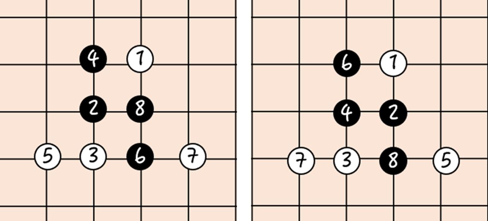

# Zobrist 散列算法

## 基本过程



不同的走法最终达到的局势相同, 则可以重复利用缓存中原来计算过的结果

根据 A^B^C = A^C^B 可知, 不同步骤只要进行异步运算的值相同, 则最终值相同, 利用 code 作字典的键值可以快速找到缓存中的数据

## 代码实现

```python
# zobrist.py
class Zobrist:
    def __init__(self, n=15, m=15):
        # 初始化 Zobrist 哈希值
        self.code = self._rand()

        # 初始化两个 n × m 的空数组
        self._com = np.empty([n, m], dtype=int)
        self._hum = np.empty([n, m], dtype=int)

        # 数组与棋盘相对应
        # 给每一个位置附上一个随机数, 代表不同的状态
        for x, y in np.nditer([self._com, self._hum], op_flags=["writeonly"]):
            x[...] = self._rand()
            y[...] = self._rand()

    def _rand(self, k=31):
        return secrets.randbits(k)

    def go(self, x, y, role):
        # 判断本次操作是 AI 还是人, 并返回相应位置的随机数
        code = self._com[x, y] if role == R["rival"] else self._hum[x, y]
        # 当前键值异或位置随机数
        self.code = self.code ^ code
```

```python
# minimax.py
# 开启缓存
if C["cache"]:
    # 获取缓存中与当前 zobrist 散列键值相同的缓存数据
    c = Cache.get(board._zobrist.code)
    if c:
        if c["deep"] >= deep:
            # 如果缓存中的结果搜索深度不比当前小, 则结果完全可用
            cacheGet += 1  # 缓存命中
            return {
                "score": c["score"]["score"],
                "steps": steps,
                "step": step + c["score"]["step"]
            }
        else:
            if (func.greatOrEqualThan(c["score"]["score"], S["FOUR"]) or func.littleOrEqualThan(c["score"]["score"], -S["FOUR"])):
                # 如果缓存的结果中搜索深度比当前小
                # 那么任何一方出现双三及以上结果的情况下可用
                cacheGet += 1
                return {
                    "score": c["score"]["score"],
                    "steps": steps,
                    "step": step + c["score"]["step"]
                }
```

```python
# minimax.py
def cache(board, deep, score):
    '''
    分数缓存
    '''
    if not C["cache"]:
        # 如果不开启缓存, 直接退出
        return
    if score.get("abcut"):
        # 该节点被标记为剪枝的, 直接退出
        return

    # 利用字典进行缓存
    Cache[board._zobrist.code] = {
        "deep": deep,
        "score": {
            "score": score["score"],
            "steps": score["steps"],
            "step": score["step"]
        }
    }
    # ...
```

```python
def AIput(self, p, role):
    # ...
    self._zobrist.go(p[0], p[1], role)  # 每次落子后修改 zobrist.code d
```

## 参考资料

1. [维基百科](https://en.wikipedia.org/wiki/Zobrist_hashing)
2. [Zobrist缓存](https://www.bookstack.cn/read/lihongxun945-gobang-ai/fddd888addab81b9.md)
3. [Zobrist哈希](https://blog.csdn.net/yzfydit/article/details/52459479)